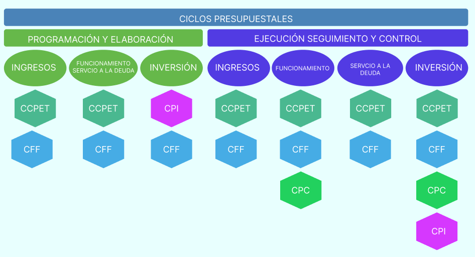

## Componente financiero

### Presupuesto:
- Este módulo permite la planeación y ejecución del presupuesto público, con las características especiales para el manejo y utilización de todos los catálogos presupuestales para formar el rubro presupuestal, según se avance en las etapas del proceso presupuestal, indispensable la ejecución por diferentes unidades ejecutoras y el presupuesto con y sin situación de fondos.
Los ciclos presupuestales se aplican como lo ilustra la siguiente grafica.

{:style="display:block; margin-left:auto; margin-right:auto"}
